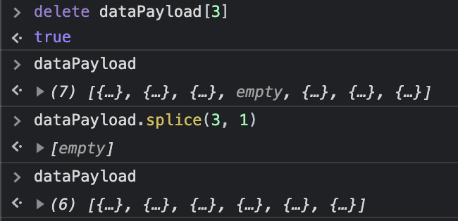

# JavaScript Crash Course

With a helping of Node.

- [ES6 Things](#ES6-Things)
- [The Spread Operator](#The-Spread-Operator)
- [The Optional Operator](#The-Optional-Operator)
- [Builtin Methods](#uiltin-Methods)
  - [Number Methods](#Number-Methods)
  - [String Methods](#String-Methods)
  - [Array Methods](#Array-Methods)
  - [Number Methods: Full Reference](#Number-methods-full–reference)
    - [ParseInt](#ParseInt)
    - [ToFixed](#ToFixed)
  - [String Method: Full Reference](#String-Method-Full-Reference)
    - [Length](#Length)
    - [Concat](#concat)
    - [Replace](#Replace)
    - [indexOf and lastIndexOf](#indexOf-and-lastIndexOf)
    - [Search](#Search)
    - [Split](#Split)
    - [Slice](#Slice)
    - [Match](#Match)
  - [Array Methods: Full Reference](#Array-Methods-Full-Reference)
    - [Delete Method](#Delete-Method)
    - [Splice (Array)](#Splice "Array")
      - [Remove element at given index with Splice](#Remove-element-at-given-index-with–Splice)
    - [Concat (Array)](#Concat "Array")
    - [Slice](#Slice)
    - [Sort](#Sort)
    - [Reduce (Array)](#Reduce "Array")
- [The Compare Function](#The-Compare-Function)
- [IIFE](#IIFE)
- [Snippets](#Snippets)
  - [Debounce](#Debounce)
- [Legnthy but with Pictures](#Legnthy-but-with-Pictures)
- [Splice Over Delete](#-Over-Delete)

## ES6 Things

### The Spread Operator

```js
const updatedArray = [...previousState, newElement];
```

### The Optional Operator

```js
// Deeply nested fields got ya down?
const value = deeply.nested.field;

// Keep it optional
const value = deeply?.nested?.field;
```

## Builtin Methods

JavaScript (ES6) has a wealth of builtin method helpers.

### Number Methods

**Returning numbers**:

- `parseInt(str)` - accept string, return whole number; rounds down, spaces ok but only returns first number
- `parseFloat(str)` - accepts string, returns number; spaces ok but only returns first number
- `Number(n)` - number method returns a number converted from its argument

**Returning string**:

- `num.toFixed(n)` - called on number, returns string of number, accepts optional argument to set number of decimals. returns string formatted with supplied number of decimals to the right; rounds properly, good for currency
- `num.toPrecision(n)` - called on number, returns string, accepts optional number to specify significant figures
- `num.toExponential(n)` - called on number, returns string, accepts optional argument to set exponential notation
- `num.toString()` - called on number, returns string

### String Methods

- `str[n]` - return nth characther of str at given index
- `str.chartAt(n)` - returns charachter at the specified index
- `str.length` - returns legnth of string

Modifying strings

- `str.concat(str2, strN)` - combines text of two or more strings
- `str.toLowerCase()` - lowercase entire string
- `str.toUpperCase()` - uppercase entire string
- `str.split("-")` - split string into array of substrings separated by supplied argument

Finding things in a string

- `str.replace("stringForDeletion", "replacementString")` - finds match between regex and a string, replaces matched subscrting with new string.
- `str.includes("search text")` - returns true if search text is found in searched string
- `str.indexOf("search text")`- returns the index of the first occurance of specified string
- `str.lastIndexOf("search text")`- returns the index of thelast occurance of specified string
- `str.slice(5, 10)` - extracts part of string from old string. Takes two arguments start and end (but not including) position

### Array Methods

- `arr.pop()` - remove last element from array
- `arr.push(x)` - adds element to end of array
- `arr.shift()` - removes (or shifts out) first element from arrray
- `arr.unshift(x)` - adds element to beginning of array

**Changing elements**

- `arr[5] = "somethingNew"` - set or change sixth element of array
- `arr[arr.length] = "anotherOne"` - use `length` to easily append new elements to the end of an array
- `delete arr[5]` - delete element at index five, length unchanged; dirty
- `arr.splice(5, 1)` - remove element 5 from array, reduce length by one; clean

**Sorting & Interating Arrays**

- `arr.find(x)` - return first element in array that matches supplied criteria
- `arr.reduce()` - runs a function on each element in array to reduce it to single value
- `arr.filter()` - creates a new array with elements that pass a test
- `arr.map()` - creates a new array by performing function on each array element
- `arr.forEach()` - calls function, specifically a callback function, once for each array element
- `arr.sort()` - sorts an array alphabetically; mutates existing array
- `arr.reverse()` - reverses an array; mutates existing array
- `arr.every()` - checks if every element in array passes a test, returns true/false
- `arr.some()` - checks if some elements in an array pass a test, returns true/false

Flush out laster

- `indexOf`
- `str.substr(7, 6)`
- `str.substring(5, 10)`
- `str.trim()` - removes whitespace on boths sides of string
- `match`
- `toString`

**Full Method Reference**

## Number Methods: Full Reference

### ParseInt

`parseInt(n)` - parse string to integer

Parses a string and returns a whole number. Accepts string, returns whole number.

If passed multiple numbers, only first number returned.

```js
parseInt("10"); // returns 10
parseInt("10.25"); // returns 10
parseInt("10 200 330"); // returns 10
```

### ToFixed

> `numb.toFixed(n)` - formats number with supplied number of decimals to the right

Rounds in the right direction. Called on number, returns string, with optionally supplied number of decimals.

> `toFixed(2) is perfect for working with money

## String Method Reference

### Length

> `str.length` - returns legnth of string

```js
let string = "someString";
let stringLength = string.length;
```

### Concat

> `str.concat(str2)` - combines text of two or more strings

```js
const combined = string.concat(string2, string3, stringN);
```

### Replace

> `.replace()` - finds match between regex and a string, replaces matched subscrting with new string.

Find and replace. Returns a new string, doesn't mutate existing array. Can accept regex.

**Replace Single Instance**

```js
let string = "the good, the bad, and the ugly";
string.replace("the", "some"); // => some good, the bad, and the ugly
```

**Replace Multiple Instances**

```js
let string = "the good, the bad, and the ugly";
string.replace(/the/g, "some"); // => some good, some bad, and some ugly
```

**Regex Tricks**

- Use `/i` flag to remove case sensitivity

### indexOf and lastIndexOf

> `str.indexOf("searchText")`- returns the index of the first occurance of specified string

> `str.lastIndexOf("searchText")`- returns the index of thelast occurance of specified string

Both return `-1` if text is not found.

```js
const str = "green blue orange";
const position = str.indexOf("orange"); // => 11
```

### Search

Search method is similar to indexOf method.

```js
const str = "green blue orange";
const position = str.search("orange"); // 11
```

**`Search` vs `indexOf`**

They return same value but are not equal.

- `search()` cannot take second position argument
- `indexOf()` cannot take powerful search values, e.g., regex

### Split

`str.split("-")` - split string into array of substrings separated by supplied charachter

```js
let string = "212-505-1289";
string.split("-"); // ["212", "505", "1289"]
```

### Slice

`str.slice(5, 10)` - extracts part of string from old string. Takes two arguments start and end (but not including) position

```js
let string = "the good, the bad, and the ugly";
string.slice(5); // => "od, the bad, and the ugly"
string.slice(5, 15); // => "od, the b"
string.slice(-20); // => "he bad, and the ugly"
```

### Match

`str.match(/regex/g)` - search string for given text, returns matches in an array

Use match to search for instances of something in a string, returns results as array.

```js
const matcher = "green green green green blue";
console.log(matcher.match(/gree/g));
// => ["gree", "gree", "gree", "gree"]
```

## Array Methods

### Delete Method

> `delete arr[0]` crudely deletes element out of array

Deletes an element in an array, leaves an `undefined` crater behind.

```js
const arr = [1, 2, 3];
delete arr[0]; // arr = [undefined, 2, 3]
```

Use `pop()` or `shift()` instead.

### Splice (Array)

> `arr.splice(x, y)` - add new items to an array

Called on array, returns the deleted element(s) in the array, chosen by spplied parameters. Mutates existing array.

If splice deletes no elements, an empty array is returned.

```js
const codes = ["A", "C", "E"];
codes.splice(2, 0, "G", "Z");
// => []
// Returns empty array because nothing was deleted
```

Splice arguments:

- 1st arg: (2) position where new elements should be added (spliced in)
- 2nd arg (0): how many elements should be removed
- Remaining args ("G", "Z"): new elements to be added

#### Remove single element at given index with Splice

```js
// where index is x
someArray.splice(x, 1);
```

### Concat (Array)

> `arr.concat()` - merging arrays (concatenating arrays)

Called on array, accepts unlimited arrays, returns new array, does not modify existing arrays.

```js
const mergedArr = arr1.concat(arr2);
```

### Slice

> `arr.slice()` - cut slice out of existing array without changing it

Called on array, returns slice of array from specified params. Does not modify existing array.

Cut slices out of strings. Supplied argument keeps everything from that position to the right.

The `slice()` method creates a new array. Nothing is removed from the source array.

```js
const arr = ["A", "B", "C", "D", "E"];
const slicedArr = arr.slice(2); // => ["C", "D", "E"]
```

### Sort

> `arr.sort()` best effort attempt at sorting elements; mutates array it's called on

Called on array, returns array; mutates array it's called on.

**Alphabetical sorting**

```js
let arr = ["A", "E", "V", "D"];
arr.sort();
// ==> ["A", "D", "E", "V"]
```

**Numberic Sorting**

Sorting numbers requires more work. Remember this function.

```js
var scores = [30, 2, 99, 87, 1, 100, 54];
scores.sort(function (a, b) {
  return a - b;
});
```

**Random Order Sorting**

```js
var points = [40, 100, 1, 5, 25, 10];
points.sort(function (a, b) {
  return 0.5 - Math.random();
});
```

### Reduce (Array)

#### Count occurances in an array

Create an object to display how many times a value occures in an object in an array.

```js
const flights = [
  { departureAirport: "JFK" }
  { departureAirport: "IAD" }
  { departureAirport: "JFK" }
]

const airportMap = flights
    .map((char) => char.departureAirport)
    .reduce(reducer, {});

// => { JFK: 2, IAD: 1 }
```

<!--
*
*
* -->

## The Compare Function

```js
// sort order, works well for numbers
points.sort((a, b) => a - b )

// another definition
function(a, b){return a - b}
```

## IIFE

Immediately nvoked Function Expression (IIFE) is a way to execute code immediately when it's defined.

They don't pollute the global object and they're a simple was to isoldate variable declarations.

### IIFE Syntax

```js
(function () {
  // code
});


(() => {
    // code
}){}
```

Named IIFE

IIFEs can be named - they cannot leak out into the global scope and they cannot be called again.

Only work for regular named functions, not arrow functions.

```js
(function aThing() {
  //
})();
```

## Snippets

### Debounce

```js
const debounce = (func, wait) => {
  let timeout;

  return function executedFunction(...args) {
    const later = () => {
      clearTimeout(timeout);
      func(...args);
    };

    clearTimeout(timeout);
    timeout = setTimeout(laster, wait);
  };
};
```

```js
var returnedFunction = debounce(function () {
  // taxing stuff
}, 250);
```

## Legnthy but with Pictures

### Splice Over Delete

The `delete` method removes an element from an array, but not it's history. An undefined crater is left behind.



If you want to remove a single element from an array (not first or last or know).
